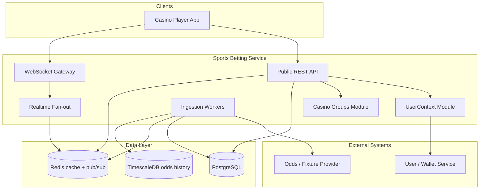
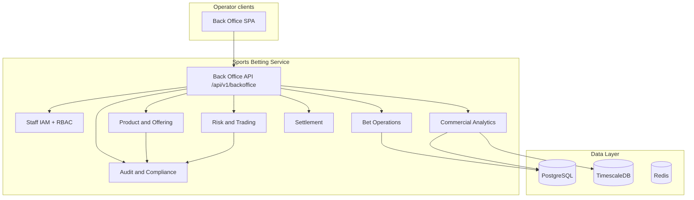

# Sports Betting Service — Design Document

**Version:** 0.3 (draft)  
**Status:** Planning  
**Stack:** NestJS 11, TypeScript, Node.js  
**Last updated:** 2026-05-30

---

## 1. Purpose

Build a backend service that exposes **live sports events**, **schedules (fixtures)**, and **betting markets with odds** to casino frontends. User identity, balance, and casino-group membership come from an **external user/wallet service** — this application does not own user accounts or ledger storage.

The service must support **multi-tenant operation** (per casino group / white-label operator) and deliver **low-latency odds updates** for in-play betting.

In a **later phase**, each casino group will use an **operator back office** (industry term: *operator portal*) — a separate web app from the player sportsbook — so their staff can run the book day-to-day: manage the **product offering**, monitor **risk and liability**, handle **bets and settlements**, and review **commercial performance**, with full **audit** for compliance. The backend should be shaped for that from the start (tenant isolation, immutable audit, read models for analytics) even though the portal UI ships later.

---

## 2. Goals and non-goals

### Goals


| ID  | Goal                                                                                                              |
| --- | ----------------------------------------------------------------------------------------------------------------- |
| G1  | Serve schedules and live event state (scores, period, status)                                                     |
| G2  | Serve markets and selections with current odds, including in-play updates                                         |
| G3  | Scope all content and configuration by **casino group**                                                           |
| G4  | Authenticate callers via upstream-issued tokens; resolve `UserContext` per request                                |
| G5  | Integrate one or more **odds/fixture data providers** via adapter pattern                                         |
| G6  | Push real-time updates (odds, scores, market suspend) to connected clients                                        |
| G7  | Operate reliably when upstream user or odds APIs are degraded (defined fallbacks)                                 |
| G8  | *(Future)* Operator back office for each casino group: IAM, trading/risk, product, bet ops, analytics, compliance |


### Non-goals (initial phases)


| ID  | Out of scope (unless explicitly added later)                                                                             |
| --- | ------------------------------------------------------------------------------------------------------------------------ |
| NG1 | Local **player** registration, passwords, KYC storage (players stay on external user service)                            |
| NG2 | Authoritative wallet / balance ledger (read/debit via external service only)                                             |
| NG3 | Full bet settlement engine (optional Phase 4+)                                                                           |
| NG4 | Odds compilation / trading desk UI                                                                                       |
| NG5 | Payment rails, withdrawals, bonuses                                                                                      |
| NG6 | Operator portal **UI** in v1 (back-office APIs phased; SPA in Phase 6)                                                   |
| NG7 | Full **trading desk** / odds compilation (prices come from provider; portal controls offering and risk, not line-making) |


---

## 3. Stakeholders and consumers


| Consumer                                  | Needs                                                                                |
| ----------------------------------------- | ------------------------------------------------------------------------------------ |
| Casino web / mobile app (players)         | Schedules, live scores, markets, odds, WebSocket subscriptions                       |
| **Casino operator staff** *(future)*      | Back office: product offering, trading/risk, bet monitor, settlements, P&L analytics |
| **Platform operator** *(optional future)* | Cross-tenant oversight, break-glass support (heavily audited)                        |
| External user service                     | Source of truth for **player** identity, balance, limits, casino group               |
| Odds / fixture provider(s)                | Source of truth for sports data and prices                                           |


---

## 4. Functional requirements

### 4.1 Sports catalog (mostly static)


| Req ID | Requirement                                                           | Priority |
| ------ | --------------------------------------------------------------------- | -------- |
| FR-S1  | Expose sports, leagues/competitions, and teams/participants           | P1       |
| FR-S2  | Support localization fields where provider supplies them (name, slug) | P2       |
| FR-S3  | Cache catalog with long TTL; refresh on schedule or webhook           | P1       |


### 4.2 Fixtures (schedule)


| Req ID | Requirement                                                 | Priority |
| ------ | ----------------------------------------------------------- | -------- |
| FR-F1  | List upcoming fixtures by sport, league, date range         | P1       |
| FR-F2  | Filter fixtures by casino group (enabled leagues only)      | P1       |
| FR-F3  | Return kickoff time, venue (if available), participants     | P1       |
| FR-F4  | Ingest fixture updates from provider (postponed, cancelled) | P1       |


### 4.3 Events (live game state)


| Req ID | Requirement                                                                 | Priority |
| ------ | --------------------------------------------------------------------------- | -------- |
| FR-E1  | Expose event status: `scheduled`, `live`, `suspended`, `ended`, `cancelled` | P1       |
| FR-E2  | Expose live score / period / clock where provider supports                  | P1       |
| FR-E3  | List live events per sport and per casino group                             | P1       |
| FR-E4  | Map provider event IDs to internal stable IDs                               | P1       |


### 4.4 Markets and odds


| Req ID | Requirement                                                           | Priority |
| ------ | --------------------------------------------------------------------- | -------- |
| FR-M1  | Expose markets per event (e.g. match winner, handicap, totals)        | P1       |
| FR-M2  | Each market has selections (outcomes) with price (decimal odds)       | P1       |
| FR-M3  | Market/selection status: `open`, `suspended`, `settled`, `void`       | P1       |
| FR-M4  | Apply casino-group rules (enabled market types, margin if configured) | P2       |
| FR-M5  | Store odds change history for audit and charts (TimescaleDB)          | P2       |
| FR-M6  | Never use JS `number` for prices or stakes in domain logic            | P1       |


**Market terminology**

- **Event** — one fixture instance (e.g. Team A vs Team B).
- **Market** — a bet type on that event (e.g. `1X2`, `Asian Handicap -0.5`).
- **Selection** — one pick within a market (e.g. `Home`, `Draw`, `Away`).
- **Price** — decimal odds for a selection at a point in time.

### 4.5 User context (external service)


| Req ID | Requirement                                                                           | Priority |
| ------ | ------------------------------------------------------------------------------------- | -------- |
| FR-U1  | Verify JWT (JWKS) or introspect opaque token per request                              | P1       |
| FR-U2  | Resolve `userId`, `casinoGroupId`, `currency`, `locale` into `UserContext`            | P1       |
| FR-U3  | Fetch balance from external API when needed (bet placement); short TTL cache optional | P1       |
| FR-U4  | Reject requests if identity cannot be verified                                        | P1       |
| FR-U5  | Tag all logs/metrics with `casinoGroupId` and `userId` (hashed if required)           | P1       |


### 4.6 Casino groups (multi-tenancy)


| Req ID | Requirement                                                              | Priority |
| ------ | ------------------------------------------------------------------------ | -------- |
| FR-C1  | Store per-group settings: enabled sports/leagues, market types, currency | P1       |
| FR-C2  | Enforce group scope in every read path (repository or query middleware)  | P1       |
| FR-C3  | Rate limit per casino group (not only per IP)                            | P2       |
| FR-C4  | WebSocket rooms namespaced by group: `group:{id}:event:{id}`             | P1       |


### 4.7 Real-time


| Req ID | Requirement                                               | Priority |
| ------ | --------------------------------------------------------- | -------- |
| FR-R1  | WebSocket (or SSE) channel for odds and score updates     | P1       |
| FR-R2  | Client subscribes to event or market IDs                  | P1       |
| FR-R3  | Fan-out via Redis pub/sub when running multiple instances | P2       |
| FR-R4  | Heartbeat / reconnect guidance documented in API          | P2       |


### 4.8 Betting (optional phase)


| Req ID | Requirement                                                | Priority |
| ------ | ---------------------------------------------------------- | -------- |
| FR-B1  | Place bet only after fresh balance check or wallet reserve | P3       |
| FR-B2  | Idempotency key on every bet attempt                       | P3       |
| FR-B3  | Outbox pattern for wallet debit retries                    | P3       |


### 4.9 Operator back office (future — Phase 6)

White-label sportsbooks typically give each **operator (casino group)** a **back office** used by internal staff — not players. Capabilities below reflect common industry practice (platforms such as Kambi-style portals, SBTech/OpenBet-style ops tools, and in-house books at major operators). This service owns **sportsbook operations data**; player CRM, KYC, and wallet ledger stay on the external user service.

The portal is a **separate SPA** consuming `**/api/v1/backoffice`** APIs. Staff accounts are **not** player accounts (see §10.3).

#### 4.9.1 Capability map (how the industry organizes it)


| Domain                   | What operators do here                                                                                 | Typical roles               |
| ------------------------ | ------------------------------------------------------------------------------------------------------ | --------------------------- |
| **Identity & access**    | Staff login, MFA, roles, session management                                                            | Operator admin              |
| **Tenant & brand**       | Jurisdiction, currencies, locales, branding hooks, integration keys                                    | Operator admin              |
| **Product & offering**   | Which sports/leagues/events/market types appear to players; display order; prematch vs in-play toggles | Product manager, trader     |
| **Trading & risk**       | Liability/exposure views, stake/payout caps, manual suspend, alert thresholds                          | Trader, risk                |
| **Bet operations**       | Bet monitor (search, detail), void/cancel/adjust *(permissioned)*, bet exceptions queue                | Support, trader, settlement |
| **Results & settlement** | Result status per event, settlement batches, void rules, reconciliation vs provider                    | Settlement, finance         |
| **Commercial analytics** | Turnover, bet count, GGR/NGR-style sportsbook metrics, hold %, breakdowns by sport/league/market       | Finance, management         |
| **Compliance & audit**   | Immutable action log, export for regulators, optional RG limit visibility from user service            | Compliance                  |


**Out of scope for this portal (usually other systems):** player registration, payments, bonus campaigns, full CRM, odds compilation/trading desk.

#### 4.9.2 Identity & access management


| Req ID | Requirement                                                                | Priority |
| ------ | -------------------------------------------------------------------------- | -------- |
| FR-BO1 | Staff sign-in with short-lived access token; refresh rotation              | P4       |
| FR-BO2 | Each staff user scoped to exactly one `casinoGroupId` by default           | P4       |
| FR-BO3 | RBAC with industry-standard roles (see below) and fine-grained permissions | P4       |
| FR-BO4 | MFA for privileged roles; optional OIDC/SAML for enterprise operators      | P4       |
| FR-BO5 | Session revoke, forced logout, password lifecycle                          | P4       |


**Reference roles** (map to permissions, not hard-coded UI tabs):


| Role               | Primary responsibilities                             |
| ------------------ | ---------------------------------------------------- |
| `operator_admin`   | Staff users, tenant settings, integrations           |
| `trader`           | Offering, suspends, risk limits, exposure            |
| `risk_manager`     | Liability caps, alerts, override approval            |
| `customer_support` | Bet lookup, player ref (read-only), exception triage |
| `settlement`       | Results, settlement runs, voids                      |
| `finance`          | Commercial analytics, exports, reconciliation views  |
| `compliance`       | Audit log, regulatory exports (read-heavy)           |
| `read_only`        | Dashboards and search without mutations              |


#### 4.9.3 Tenant & brand settings


| Req ID | Requirement                                                                        | Priority |
| ------ | ---------------------------------------------------------------------------------- | -------- |
| FR-BO6 | Edit operator profile: display name, default currency, timezone, supported locales | P4       |
| FR-BO7 | Jurisdiction / regulatory profile flags that drive feature availability            | P4       |
| FR-BO8 | White-label references (logo URL, theme tokens) passed to player clients           | P5       |
| FR-BO9 | API keys / webhook endpoints for operator’s own frontends (rotate, audit)          | P5       |


#### 4.9.4 Product & offering management


| Req ID  | Requirement                                                                             | Priority |
| ------- | --------------------------------------------------------------------------------------- | -------- |
| FR-BO10 | Curate **sportsbook catalog**: enable/disable sports, leagues, competitions             | P4       |
| FR-BO11 | Control **market types** per sport (e.g. match result, handicap, totals)                | P4       |
| FR-BO12 | Event-level overrides: hide event, delay in-play, boost visibility (ordering)           | P4       |
| FR-BO13 | Product rules: prematch-only vs in-play allowed per league or event                     | P4       |
| FR-BO14 | Optional **price presentation** rules (margin display, rounding) — not line compilation | P5       |


#### 4.9.5 Trading & risk management


| Req ID  | Requirement                                                                                     | Priority |
| ------- | ----------------------------------------------------------------------------------------------- | -------- |
| FR-BO15 | **Exposure / liability** dashboard: open stake and potential payout by event, market, selection | P4       |
| FR-BO16 | Configure **stake limits** (min/max), **max payout**, per bet and per market                    | P4       |
| FR-BO17 | **Manual suspend/resume** markets or events for this tenant with mandatory reason code          | P4       |
| FR-BO18 | Risk alerts when exposure crosses thresholds (in-app + webhook optional)                        | P5       |
| FR-BO19 | “Panic” suspend all in-play for tenant *(break-glass, heavily audited)*                         | P5       |


#### 4.9.6 Bet operations (bet monitor)


| Req ID  | Requirement                                                                              | Priority |
| ------- | ---------------------------------------------------------------------------------------- | -------- |
| FR-BO20 | **Bet search**: filters by time, status, player ref, event, market, stake, odds band     | P4       |
| FR-BO21 | **Bet detail**: legs, price at acceptance, stake, currency, status timeline              | P4       |
| FR-BO22 | Permissioned **void / cancel** with reason codes (pre-settlement only where rules allow) | P4       |
| FR-BO23 | **Exception queue** for failed wallet sync, stale placement, settlement mismatches       | P4       |
| FR-BO24 | Deep link to external user service for full player profile (by `userId` ref only)        | P5       |


#### 4.9.7 Results & settlement


| Req ID  | Requirement                                                                   | Priority |
| ------- | ----------------------------------------------------------------------------- | -------- |
| FR-BO25 | Event **result** view aligned with provider feed; highlight unsettled markets | P4       |
| FR-BO26 | Settlement job status per event (pending, applied, failed) with retry         | P4       |
| FR-BO27 | Post-settlement adjustments (void leg, regrade) — dual control optional       | P5       |
| FR-BO28 | Reconciliation view: bets settled vs provider result timestamps               | P4       |


#### 4.9.8 Commercial analytics (BI layer)


| Req ID  | Requirement                                                                                  | Priority |
| ------- | -------------------------------------------------------------------------------------------- | -------- |
| FR-BO29 | **Executive summary**: turnover, bet count, GGR (stakes − payouts), open liability           | P4       |
| FR-BO30 | Breakdowns by sport, league, market type, prematch vs in-play, time bucket                   | P4       |
| FR-BO31 | **Hold %** and average odds metrics for trading review                                       | P4       |
| FR-BO32 | Large exports via async jobs; scheduled email/report webhooks optional                       | P5       |
| FR-BO33 | Pre-aggregated **daily rollups** (materialized views) — analytics must not starve player API | P4       |


Player wallet balances are **not** recomputed here; sportsbook P&L is derived from **bets accepted and settled in this service**.

#### 4.9.9 Compliance & audit


| Req ID  | Requirement                                                                                         | Priority |
| ------- | --------------------------------------------------------------------------------------------------- | -------- |
| FR-BO34 | **Append-only audit log** for all back-office mutations (actor, entity, before/after, reason)       | P4       |
| FR-BO35 | Searchable audit UI for compliance; export by date range                                            | P4       |
| FR-BO36 | Surface responsible-gaming signals from user service (limits, exclusion) read-only where API exists | P5       |
| FR-BO37 | Data retention policies per jurisdiction documented and enforceable                                 | P4       |


#### 4.9.10 Portal information architecture (UX reference)

Suggested primary navigation (drives API grouping, not literal folder names):

```text
Home (KPIs + alerts)
├── Trading
│   ├── Live events & markets
│   ├── Exposure & liability
│   └── Limits & suspends
├── Product
│   ├── Sports & competitions
│   └── Market types & rules
├── Bets
│   ├── Bet monitor
│   └── Exceptions
├── Settlement
│   ├── Results
│   └── Settlement runs
├── Analytics
│   ├── Performance
│   └── Exports
├── Compliance
│   └── Audit log
└── Settings
    ├── Tenant & brand
    ├── Staff & roles
    └── Integrations
```

---

## 5. Non-functional requirements


| Req ID | Category             | Requirement                                                                  |
| ------ | -------------------- | ---------------------------------------------------------------------------- |
| NFR-1  | Latency              | P95 REST read < 200ms (cached); odds push < 500ms from provider receipt      |
| NFR-2  | Availability         | 99.9% target; degrade bet placement if wallet down, keep feed if possible    |
| NFR-3  | Scalability          | Horizontal scale of API + WS nodes; stateless app except Redis/DB            |
| NFR-4  | Security             | TLS, JWT validation, no secrets in repo, helmet, throttling                  |
| NFR-5  | Observability        | Structured logs (pino), health/readiness, metrics, error tracking            |
| NFR-6  | Data                 | Postgres for relational; Redis for cache/pub-sub; Timescale for odds history |
| NFR-7  | Compliance           | Configurable per-group limits; audit trail for odds and bets (when added)    |
| NFR-8  | Back office security | Separate staff auth realm; MFA; RBAC; audit on all mutations                 |
| NFR-9  | Reporting            | Heavy queries via rollups/async jobs; do not block player API                |


---

## 6. High-level architecture

### 6.1 Player-facing (Phases 0–5)




### 6.2 Operator back office (future — Phase 6)




**Separation principles**

- **Route prefix:** `/api/v1` (players) vs `/api/v1/backoffice` (staff). Avoid overloading player JWTs on back-office routes.
- **Guards:** `PlayerAuthGuard` vs `StaffAuthGuard` + permission checks per domain (trading, settlement, etc.).
- **Tenant scope:** `casinoGroupId` comes only from the staff session — never from request body for authorization.
- **Workload isolation:** Heavy analytics queries use rollups, read replica, or async jobs — never block the player path.
- **CORS:** Back-office origin allowlist per environment.

### Data flow (ingestion → client)

1. **Cron / queue worker** pulls or receives webhook from odds provider.
2. Normalizer maps provider payload → internal domain models.
3. Persist fixture/event/market/selection state in Postgres; append odds ticks to Timescale.
4. Publish change event to Redis channel.
5. WebSocket gateway subscribers in that casino group receive update.

---

## 7. Module layout

```
src/
  main.ts
  app.module.ts
  modules/
    user-context/       # JWT guard, UserContext, upstream HTTP client
    casino-groups/      # Tenant config, enabled leagues/markets
    sports/             # Sport, league, team catalog
    fixtures/           # Schedule queries
    events/             # Live state, scores
    markets/            # Markets + selections + current odds
    odds-history/       # Timescale writes / queries (optional P2)
    providers/          # Adapter per upstream (Sportradar, The Odds API, …)
    ingestion/          # BullMQ jobs, schedulers, webhooks
    realtime/           # Socket.IO gateway, room management
    bets/               # Phase 4 — placement, validation
    settlement/         # Phase 4+ — result application
    backoffice/         # Phase 6 — staff portal APIs (domain-split controllers)
      staff-auth/       # IAM: login, roles, sessions
      tenant/           # Brand, jurisdiction, integrations
      product/          # Catalog curation, market-type rules
      trading/          # Exposure, limits, suspend/resume
      bet-operations/   # Bet monitor, voids, exception queue
      settlement/       # Results view, settlement ops (staff-facing)
      analytics/        # KPIs, rollups, exports
      compliance/       # Audit search and export
    audit/              # Phase 6 — shared append-only audit writer
  shared/
    config/             # @nestjs/config + env validation
    database/           # Prisma or Drizzle client
    cache/              # Redis module
    http/               # Axios + retry + circuit breaker
    money/              # decimal.js helpers
    logging/            # pino, request context
```

---

## 8. Core domain model

### Entities (logical)


| Entity                 | Key fields                                             | Notes                      |
| ---------------------- | ------------------------------------------------------ | -------------------------- |
| `Sport`                | id, name, slug                                         | Catalog                    |
| `League`               | id, sportId, name, region                              | Filtered per casino group  |
| `Team`                 | id, name                                               |                            |
| `Fixture`              | id, leagueId, startsAt, homeId, awayId, status         | Schedule                   |
| `Event`                | id, fixtureId, providerRef, liveState                  | 1:1 with fixture when live |
| `Market`               | id, eventId, type, status, specifiers                  | e.g. line -0.5             |
| `Selection`            | id, marketId, name, status                             |                            |
| `OddsSnapshot`         | selectionId, price, capturedAt                         | Timescale hypertable       |
| `CasinoGroup`          | id, name, settings JSON                                | Tenant                     |
| `CasinoGroupLeague`    | groupId, leagueId, enabled                             | Join table                 |
| `Bet`                  | id, userId, groupId, selections, stake, status         | Phase 4                    |
| `StaffUser`            | id, email, casinoGroupId, roles[], status              | Phase 6 — not a player     |
| `StaffSession`         | id, staffUserId, expiresAt                             | Phase 6                    |
| `OfferingPolicy`       | groupId, sport/league/market rules                     | Phase 6 — product curation |
| `RiskLimit`            | groupId, scope, minStake, maxStake, maxPayout          | Phase 6                    |
| `BetException`         | id, betId, type, status, assignee                      | Phase 6 — ops queue        |
| `AnalyticsDailyRollup` | groupId, date, dimensions, metrics                     | Phase 6                    |
| `AuditLogEntry`        | id, actorId, action, entity, before, after, reason, at | Phase 6 — append-only      |
| `ExportJob`            | id, groupId, reportType, params, status, fileUrl       | Phase 6                    |


### `UserContext` (request-scoped, not persisted)

```ts
interface UserContext {
  userId: string;
  casinoGroupId: string;
  currency: string;
  locale?: string;
  // balance?: Decimal — loaded on demand only
}
```

### `StaffContext` (request-scoped, Phase 6)

```ts
interface StaffContext {
  staffUserId: string;
  casinoGroupId: string;
  roles: StaffRole[]; // e.g. ['trader', 'settlement']
  permissions: string[]; // e.g. 'trading.suspend', 'bets.void'
}
```

### Market type examples


| Code               | Description                |
| ------------------ | -------------------------- |
| `MATCH_RESULT`     | 1X2                        |
| `HANDICAP`         | Asian / European with line |
| `TOTAL`            | Over/Under goals/points    |
| `DOUBLE_CHANCE`    | 1X, X2, 12                 |
| `BOTH_TEAMS_SCORE` | Yes/No                     |


Provider adapters map foreign market codes → internal `MarketType` enum.

---

## 9. API outline (REST)

Base path: `/api/v1`  
Auth: `Authorization: Bearer <token>` on protected routes.


| Method | Path                            | Description                           | Auth               |
| ------ | ------------------------------- | ------------------------------------- | ------------------ |
| GET    | `/sports`                       | List sports (group-filtered)          | Optional           |
| GET    | `/leagues?sportId=`             | Leagues for sport                     | Optional           |
| GET    | `/fixtures?from=&to=&leagueId=` | Schedule                              | Optional           |
| GET    | `/events/live`                  | Live events                           | Optional           |
| GET    | `/events/:id`                   | Event detail + live state             | Optional           |
| GET    | `/events/:id/markets`           | Markets and selections with odds      | Optional           |
| GET    | `/markets/:id`                  | Single market                         | Optional           |
| WS     | `/realtime`                     | Subscribe `event:{id}`, `market:{id}` | Required           |
| POST   | `/bets`                         | Place bet                             | Required (Phase 4) |
| GET    | `/health`                       | Liveness                              | Public             |
| GET    | `/ready`                        | Readiness (DB, Redis, upstream)       | Public             |


OpenAPI via `@nestjs/swagger` — tag routes `player` vs `backoffice`.

### 9.1 Back office API outline (Phase 6 — `/api/v1/backoffice`)

Auth: staff Bearer token. All routes scoped to `StaffContext.casinoGroupId`. Paths grouped by **industry domain** (not by generic “config/records/reports”).


| Domain     | Method    | Path                           | Description                         |
| ---------- | --------- | ------------------------------ | ----------------------------------- |
| IAM        | POST      | `/auth/login`                  | Staff login                         |
| IAM        | POST      | `/auth/logout`                 | Revoke session                      |
| IAM        | GET       | `/staff/me`                    | Profile + permissions               |
| IAM        | CRUD      | `/staff/users`                 | Manage staff (operator_admin)       |
| Tenant     | GET/PATCH | `/tenant`                      | Brand, currency, jurisdiction       |
| Product    | GET/PUT   | `/product/sports`              | Enabled sports                      |
| Product    | GET/PUT   | `/product/leagues`             | Enabled competitions                |
| Product    | GET/PUT   | `/product/market-types`        | Market type rules per sport         |
| Trading    | GET       | `/trading/exposure`            | Liability by event/market/selection |
| Trading    | GET/PATCH | `/trading/limits`              | Stake/payout caps                   |
| Trading    | POST      | `/trading/events/:id/suspend`  | Suspend event (reason code)         |
| Trading    | POST      | `/trading/markets/:id/suspend` | Suspend market                      |
| Trading    | POST      | `/trading/markets/:id/resume`  | Resume market                       |
| Bets       | GET       | `/bets`                        | Bet monitor (search)                |
| Bets       | GET       | `/bets/:id`                    | Bet detail + timeline               |
| Bets       | POST      | `/bets/:id/void`               | Void bet (permissioned)             |
| Bets       | GET       | `/bets/exceptions`             | Exception queue                     |
| Settlement | GET       | `/settlement/events`           | Result status by event              |
| Settlement | POST      | `/settlement/events/:id/run`   | Trigger/retry settlement            |
| Settlement | GET       | `/settlement/runs/:id`         | Settlement run detail               |
| Analytics  | GET       | `/analytics/summary`           | Executive KPIs                      |
| Analytics  | GET       | `/analytics/performance`       | Turnover, GGR, hold % breakdowns    |
| Analytics  | POST      | `/analytics/exports`           | Start async export                  |
| Analytics  | GET       | `/analytics/exports/:id`       | Download export                     |
| Compliance | GET       | `/compliance/audit`            | Search audit log                    |
| Compliance | GET       | `/compliance/audit/export`     | Regulatory export job               |


Permissions are enforced per route (e.g. `trading.suspend`, `bets.void`, `analytics.export`) — see future `docs/BACKOFFICE.md`.

---

## 10. External integrations

### 10.1 User / wallet service


| Concern         | Approach                                                                |
| --------------- | ----------------------------------------------------------------------- |
| Authentication  | JWT validated with `jwks-rsa` against issuer JWKS                       |
| Profile         | `GET /users/me` or claims in JWT                                        |
| Balance         | `GET /wallet/balance` — fresh read before bet; cache ≤ 2s if allowed    |
| Debit / reserve | `POST /wallet/reserve` + commit/release (preferred) or idempotent debit |
| Resilience      | Timeouts, circuit breaker (`cockatiel`), fail closed on identity        |


**Open decisions (fill before implementation)**

- JWT issuer URL and required claims
- Opaque token vs JWT
- Reserve/commit API contract
- Webhooks for balance/limit changes

### 10.2 Odds / fixture provider


| Concern     | Approach                                               |
| ----------- | ------------------------------------------------------ |
| Ingestion   | Scheduled pull + webhook if available                  |
| Adapters    | One class per provider implementing `OddsProviderPort` |
| Id mapping  | `provider_ref` unique per entity type                  |
| Rate limits | BullMQ rate-limited queues                             |


**Open decisions**

- Primary provider name and SLA
- Webhook vs poll frequency for live odds
- Supported sports/leagues for MVP

### 10.3 Staff identity (Phase 6)


| Option                                  | When to use                                                                    |
| --------------------------------------- | ------------------------------------------------------------------------------ |
| **Local staff accounts** (this service) | Default for first back-office release; `StaffUser` + `argon2` + refresh tokens |
| **Casino corporate IdP** (OIDC/SAML)    | Enterprise operators; map IdP groups → `StaffRole`                             |
| **Shared platform IAM**                 | Multi-product casino suite; SSO across products                                |


Player JWTs from the user/wallet service **must not** grant back-office API access.

**Open decisions**

- Local auth vs OIDC for first portal release
- MFA policy per role
- Whether platform-level staff can cross tenants (break-glass only)
- Dual control for voids and post-settlement adjustments

---

## 11. Technology choices


| Layer                      | Choice                                                    | Rationale                             |
| -------------------------- | --------------------------------------------------------- | ------------------------------------- |
| Framework                  | NestJS 11 + TypeScript                                    | Already in repo; modular DI           |
| HTTP server                | Express (default) or Fastify                              | Fastify if WS+REST load is high       |
| ORM                        | Prisma (recommended) or Drizzle                           | Types, migrations                     |
| Database                   | PostgreSQL 16+                                            | Relational integrity                  |
| Odds history               | TimescaleDB extension                                     | Time-series odds                      |
| Cache / pub-sub            | Redis 7 + `ioredis`                                       | Hot odds, WS fan-out                  |
| Queue                      | BullMQ + `@nestjs/bullmq`                                 | Ingestion, outbox                     |
| Real-time                  | `@nestjs/websockets` + Socket.IO                          | Rooms per group/event                 |
| HTTP client                | `@nestjs/axios` + `cockatiel`                             | Resilient upstream calls              |
| Validation                 | `class-validator` + Swagger                               | Nest convention                       |
| Money                      | `decimal.js`                                              | No float errors                       |
| Logs                       | `nestjs-pino`                                             | JSON structured logs                  |
| Config                     | `@nestjs/config` + Zod                                    | Validated env                         |
| Back office UI *(Phase 6)* | React or Next.js SPA (`apps/backoffice` or separate repo) | Industry-standard ops portal          |
| Staff auth                 | `@nestjs/jwt` + refresh; optional OIDC                    | Separate issuer from player JWT       |
| RBAC                       | `@casl/ability` or permission map per route               | trading.*, bets.*, settlement.*, etc. |
| Analytics                  | Daily rollups + BullMQ export jobs + object storage       | Isolated from player API latency      |


---

## 12. Security and compliance notes

### Players (public API)

- Validate every token; do not trust client-sent `casinoGroupId` without matching JWT claims.
- Enforce tenant isolation in the data layer, not only in controllers.
- Use server-to-server credentials for calls to user service (client credentials / HMAC).
- Throttle public odds endpoints per `casinoGroupId`.

### Staff (back office API)

- **Separate** JWT signing key and shorter access token TTL (e.g. 15 min) with refresh rotation.
- **RBAC** on every mutating route; default deny; sensitive actions (`bets.void`, panic suspend) may require dual control.
- **Audit log** append-only for offering changes, risk actions, bet voids, settlement overrides, exports.
- **IP allowlist** optional per casino group.
- **MFA** for `operator_admin`, `trader`, `settlement`, `finance` before production portal.
- Staff see only their `casinoGroupId`; platform break-glass is rare, time-boxed, and fully audited.

### General

- Store API keys in secrets manager in production.
- Document data retention for odds history, bets, audit logs, and report exports per regulatory needs.

---

## 13. Deployment topology (reference)

```text
[Load balancer]
    → N × API/WS pods (NestJS)
    → Redis (cluster)
    → PostgreSQL (+ Timescale)
    → BullMQ workers (can be same image, different process)
```

Readiness probe fails if Postgres, Redis, or critical upstream is unreachable (configurable: allow live without wallet for read-only mode).

---

## 14. Implementation plan (phased)

### Phase 0 — Foundation (Week 1)


| Step | Task                                                 | Deliverable             |
| ---- | ---------------------------------------------------- | ----------------------- |
| 0.1  | Add `@nestjs/config`, env schema, `.env.example`     | Validated configuration |
| 0.2  | Add Prisma (or Drizzle), initial migration           | DB connection           |
| 0.3  | Add Redis module, health module (`@nestjs/terminus`) | `/health`, `/ready`     |
| 0.4  | Add `nestjs-pino`, global exception filter           | Structured logs         |
| 0.5  | Add Swagger, global validation pipe                  | `/api/docs`             |
| 0.6  | Docker Compose: Postgres, Redis, app                 | Local dev stack         |


**Exit criteria:** App boots, DB migrates, health checks pass.

---

### Phase 1 — Catalog, fixtures, and casino groups (Weeks 2–3)


| Step | Task                                                           | Deliverable        |
| ---- | -------------------------------------------------------------- | ------------------ |
| 1.1  | Schema: Sport, League, Team, Fixture, CasinoGroup, join tables | Migrations         |
| 1.2  | `casino-groups` module + seed script                           | Tenant config API  |
| 1.3  | `providers` — stub adapter + mock data                         | Testable ingestion |
| 1.4  | `ingestion` — BullMQ job to import fixtures                    | Fixtures in DB     |
| 1.5  | `fixtures` REST: list/filter by date, league, group            | FR-F1, FR-F2       |
| 1.6  | `sports` REST: sports and leagues                              | FR-S1              |


**Exit criteria:** Client can list upcoming games for a casino group.

---

### Phase 2 — Events, markets, odds (Weeks 4–5)


| Step | Task                                                    | Deliverable   |
| ---- | ------------------------------------------------------- | ------------- |
| 2.1  | Schema: Event, Market, Selection, current price columns | Migrations    |
| 2.2  | Provider adapter: map markets/selections/odds           | FR-M1–M3      |
| 2.3  | Ingestion: live state + odds update jobs                | FR-E1, FR-E2  |
| 2.4  | `events` REST: live list, detail                        | FR-E3         |
| 2.5  | `markets` REST: by event, by id                         | FR-M1, FR-M2  |
| 2.6  | `decimal.js` in all price DTOs                          | FR-M6         |
| 2.7  | Timescale hypertable + `odds-history` writer            | FR-M5 (basic) |


**Exit criteria:** REST returns live events with open markets and current odds.

---

### Phase 3 — User context and real-time (Weeks 6–7)


| Step | Task                                          | Deliverable           |
| ---- | --------------------------------------------- | --------------------- |
| 3.1  | `user-context` module: JWT guard, JWKS        | FR-U1, FR-U2          |
| 3.2  | Upstream HTTP client with circuit breaker     | FR-U4, NFR-2          |
| 3.3  | `@CurrentUser()`, `@CasinoGroup()` decorators | Ergonomic controllers |
| 3.4  | `realtime` gateway + Redis adapter            | FR-R1–R3              |
| 3.5  | Publish on ingestion after DB commit          | End-to-end push       |
| 3.6  | Per-group throttling                          | FR-C3                 |


**Exit criteria:** Authenticated client receives odds/score pushes in group-scoped rooms.

---

### Phase 4 — Betting (optional, Weeks 8–10)


| Step | Task                                 | Deliverable  |
| ---- | ------------------------------------ | ------------ |
| 4.1  | Bet schema + validation rules        |              |
| 4.2  | Balance/reserve integration          | FR-B1        |
| 4.3  | Idempotency + outbox worker          | FR-B2, FR-B3 |
| 4.4  | `POST /bets`, bet history `GET`      |              |
| 4.5  | Settlement worker (provider results) |              |


**Exit criteria:** End-to-end bet placement with safe wallet interaction.

---

### Phase 5 — Hardening (ongoing)


| Step | Task                                                                            |
| ---- | ------------------------------------------------------------------------------- |
| 5.1  | Load test WS fan-out and ingestion throughput                                   |
| 5.2  | OpenTelemetry traces + Prometheus metrics                                       |
| 5.3  | Integration tests with Testcontainers                                           |
| 5.4  | Runbooks: upstream outage, stale odds, market suspend                           |
| 5.5  | Audit log schema + hooks on tenant/offering mutations (prepare for back office) |


---

### Phase 6 — Operator back office (Weeks 11–16+)

Deliver in domain order (IAM → product → trading → bets → settlement → analytics). SPA can trail APIs by one sprint.


| Step | Task                                                                          | Deliverable     |
| ---- | ----------------------------------------------------------------------------- | --------------- |
| 6.1  | Schema: `StaffUser`, sessions, `AuditLogEntry`, `OfferingPolicy`, `RiskLimit` | Migrations      |
| 6.2  | `staff-auth`: login, RBAC, permissions matrix                                 | FR-BO1–BO5      |
| 6.3  | `tenant` + `product` APIs (catalog curation, market rules)                    | FR-BO6–BO14     |
| 6.4  | `trading` APIs: exposure, limits, suspend/resume                              | FR-BO15–BO19    |
| 6.5  | `bet-operations`: bet monitor, void, exception queue                          | FR-BO20–BO24    |
| 6.6  | Staff `settlement` views + reconciliation endpoints                           | FR-BO25–BO28    |
| 6.7  | `analytics` rollups + KPI/export jobs                                         | FR-BO29–BO33    |
| 6.8  | `compliance` audit search/export                                              | FR-BO34–BO37    |
| 6.9  | Back office SPA matching §4.9.10 navigation                                   | Portal UX       |
| 6.10 | Optional OIDC, MFA, dual control on voids                                     | FR-BO4, FR-BO27 |


**Exit criteria:** Trader suspends a live market with reason; support finds a bet and voids within policy; finance views yesterday’s GGR by sport; compliance exports audit log — all tenant-scoped and audited.

---

## 15. Testing strategy


| Level           | Scope                                                                   |
| --------------- | ----------------------------------------------------------------------- |
| Unit            | Market normalization, decimal math, group filtering                     |
| Integration     | Repositories + Postgres (Testcontainers)                                |
| Contract        | Provider adapter golden files (JSON fixtures)                           |
| E2E             | Supertest on REST; Socket.IO client for WS                              |
| Back office E2E | Staff login → suspend market → verify audit; void bet permission matrix |
| Manual          | Docker Compose smoke: subscribe to live event                           |


---

## 16. Risks and mitigations


| Risk                             | Impact                          | Mitigation                                        |
| -------------------------------- | ------------------------------- | ------------------------------------------------- |
| Provider latency / outage        | Stale or missing odds           | Circuit breaker, last-known-good, suspend markets |
| Wallet race on bet               | Double spend / failed debit     | Reserve/commit or idempotent outbox               |
| Multi-tenant leak                | Wrong odds shown to wrong brand | DB-level group filter + tests                     |
| Float rounding                   | Financial discrepancies         | `decimal.js` + `NUMERIC` columns                  |
| WS scale                         | Memory / connection limits      | Redis adapter, horizontal pods                    |
| Player token used on back office | Privilege escalation            | Separate issuer, `/backoffice` prefix, tests      |
| Analytics query slows player API | Latency regression              | Rollups, replica, async exports                   |
| Trader suspends wrong market     | Revenue loss                    | Reason codes, confirm on panic, audit + rollback  |


---

## 17. Open questions checklist

Before Phase 1 coding starts, confirm:

1. Which odds/fixture provider for MVP?
2. JWT contract from user service (claims, issuer, TTL)?
3. Is bet placement in scope for v1 or odds-display only?
4. Which sports and leagues for launch?
5. Per-group odds margin — yes/no?
6. Required jurisdictions / responsible gaming hooks from user service?
7. Target environments (AWS, GCP, on-prem) and secrets tooling?

**Operator back office (Phase 6)**

1. Local staff auth vs corporate OIDC for v1?
2. Minimum role set at launch (trader + support + finance?)?
3. Mandatory analytics: GGR only, or exposure + hold % + settlement reconciliation?
4. Void/cancel policy: who approves, dual control required?
5. Cross-tenant platform staff — yes/no?
6. PII masking rules for bet exports and audit?

---

## 18. Document history


| Version | Date       | Author | Changes                                                                 |
| ------- | ---------- | ------ | ----------------------------------------------------------------------- |
| 0.1     | 2026-05-30 | —      | Initial draft                                                           |
| 0.2     | 2026-05-30 | —      | Operator portal (initial)                                               |
| 0.3     | 2026-05-30 | —      | Back office redesigned to industry domains (not config/records/reports) |


---

## Related documents (to add)

- `docs/API.md` — OpenAPI export and WebSocket protocol
- `docs/BACKOFFICE.md` — Staff portal domains, RBAC matrix, UX IA *(Phase 6)*
- `docs/PROVIDER-ADAPTER.md` — Mapping rules per data vendor
- `docs/RUNBOOK.md` — Operations and incident response

